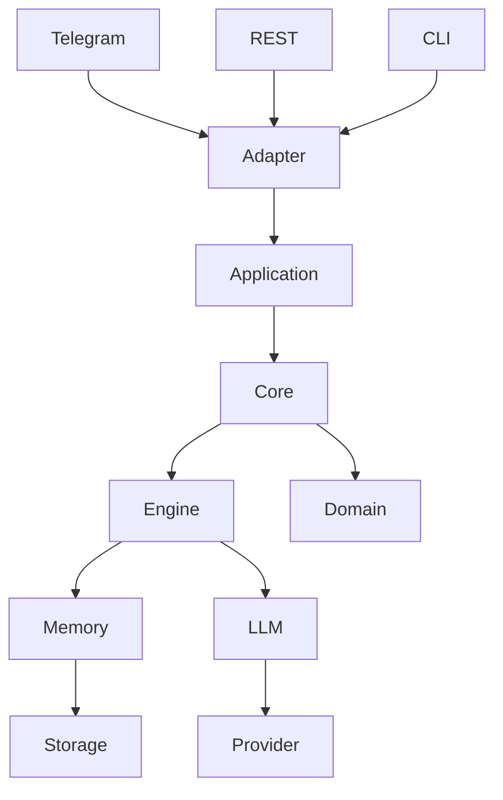
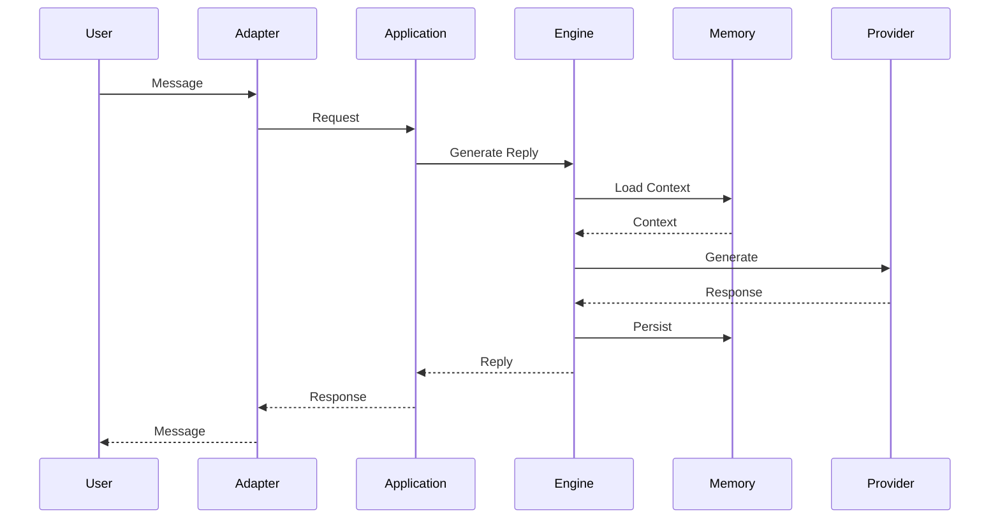

# Architecture

## Purpose

This document describes the high-level architecture of RP Engine.

It defines the system's structure, component responsibilities, dependency rules, and interaction patterns. It complements the functional specification by explaining **how the system is organized**, without prescribing implementation details.

---

# Architectural Goals

The architecture is designed to achieve the following goals:

* Platform independence
* Provider independence
* Long-term maintainability
* Testability
* Modularity
* Extensibility
* Separation of concerns

---

# Architectural Style

RP Engine follows a layered architecture inspired by Hexagonal Architecture (Ports & Adapters).

The core domain is isolated from external technologies.

External systems communicate with the application through adapters.



The core layer must not depend on Telegram, FastAPI, LM Studio, or any other external framework.

Character definition portability uses Character Card Specification v3 as the external format
contract. The canonical specification is documented in `docs/SPEC_V3.md`.

---

# Layers

## Adapters

Adapters translate external requests into application requests.

Examples include:

* Telegram
* REST API
* CLI
* Discord
* Matrix

Responsibilities:

* Receive external requests
* Validate transport-specific data
* Convert requests into application models
* Return responses to the caller

Adapters contain no business logic.

Adapter-specific responsibilities:

* Parse transport syntax (for example, Telegram slash commands)
* Enforce transport-level authorization and invocation policy
* Translate transport actions into application use cases
* Return transport-appropriate responses

For Telegram, authorization and permissions are transport concerns handled in the adapter:

* Private chats use user-level whitelist authorization.
* Group chats use group-level whitelist authorization.
* In authorized groups, all members can advance the story via `/chat <message>`; plain group messages are ignored.
* Story/session-control commands (`/play`, `/restart`, `/continue`, `/retry`) and session-directive commands (`/director`, `/rule`, `/rules`, `/language`, `/memory`) are restricted to Telegram chat administrators and creators in group chats.
* Telegram message-size limits are handled by adapter-level message splitting during delivery.
* Telegram external identities are resolved into internal engine users before calling use cases.
* Telegram command menu registration (`set_my_commands`) is adapter/runtime-owned.
* Closed-beta access messaging and beta waitlist registration (`/beta`) are transport concerns.

Adapters must not implement prompt construction, memory strategy logic, or direct LLM interaction.

The RP Engine core always returns a complete response string. Adapters are responsible for platform
delivery constraints such as maximum message length.

The RP Engine core uses internal collision-resistant user identifiers. External platform identifiers
are adapter metadata and are never used as core primary user IDs.

### Transport Commands

Transport commands belong to adapters.

Example for Telegram:

* `/start` is handled by the adapter (state-aware: auto-resume via `PlaythroughService.get_active(...)` + `resume_text(...)`, or invite to `/scenarios`)
* `/scenarios` is translated to `PlaythroughService.list_scenarios()`
* `/play <id>` is translated to `PlaythroughService.start(...)`
* `/restart` is translated to `PlaythroughService.restart(...)`
* `/continue` is translated to `ChatService.continue_story(...)` (which itself resumes a truncated reply or advances)
* `/retry` is translated to `ChatService.regenerate_last_response(...)`, then the adapter replaces the previous narrator message in place
* `/chat <message>` (groups) and plain private messages are translated to `ChatService.send_message(...)`
* `/director <instruction>`, `/rule add|remove|list`, `/rules`, `/language <code>` and `/memory [layer on|off]` are translated to `SessionDirectiveService` calls; the adapter owns the subcommand syntax and the reply wording, the domain owns validation and rule-id allocation
* `/help`, `/cancel`, and `/beta` are handled entirely by the Telegram adapter

The engine and application services never parse Telegram command syntax. Persisting the
Telegram message id of the last narrator reply (for in-place `/retry`) is a transport
concern owned by the adapter, never by the domain or application layers.

Since S031 the admin panel is a second surface that advances a story. It maps three HTTP
routes onto the same three use cases:

* `POST /admin/sessions/{id}/turn` is translated to `ChatService.send_message(...)`
* `POST /admin/sessions/{id}/continue` is translated to `ChatService.continue_story(...)`
* `POST /admin/sessions/{id}/retry` is translated to `ChatService.regenerate_last_response(...)`

Identity is the session id in the path, not a signed-in player. The panel has no
authentication and reaches a session by operator navigation, so these routes sit on the
`/admin` prefix — the same operator exception S015 made for `override_persona` — rather than
adding a second unauthenticated entry point. They answer with the *stored* narrator message
so the caller receives the turn number and the finish reason without re-reading the
transcript.

Only one generation may run per session, and `ChatService` owns that guard. Two surfaces
reaching one story is an application concern, not a transport one; each adapter only
translates the refusal into its own vocabulary (HTTP 409, or an ordinary Telegram reply).
The guard is an in-process set of session ids, which is sufficient only while Telegram and
the HTTP API share a process, as they do today in `app/main.py`.

---

## Application

The application layer coordinates use cases.

Responsibilities:

* Conversation lifecycle
* Dependency orchestration
* Transaction boundaries
* Request validation
* Error handling

The application layer does not implement domain rules.

The application layer exposes explicit, transport-agnostic use cases.

Current use-case API:

* `ChatService.send_message(...)`
* `ChatService.continue_story(...)` (truncation-aware: resumes a cut-off reply or advances)
* `ChatService.regenerate_last_response(...)`
* `ChatService.clear_conversation(...)`
* `PlaythroughService.list_scenarios()`
* `PlaythroughService.start(...)` / `PlaythroughService.restart(...)`
* `PlaythroughService.get_active(...)` / `PlaythroughService.resume_text(...)`
* `SessionDirectiveService.set_language(...)` / `add_rule(...)` / `remove_rule(...)`
* `SessionDirectiveService.add_director_instruction(...)` / `clear_director_instructions(...)` / `get(...)`
* `SessionDirectiveService.set_memory_source(...)` — which memory layers the session runs

Adapters call these use cases directly. Scenario selection is driven by the curated
catalog and `PlaythroughService`; there is no user-facing character creation/selection.

FastAPI and Telegram are both adapters over the same application API.

The application layer is also the composition root.

Responsibilities of the composition root:

* Resolve configuration
* Create infrastructure implementations
* Wire abstractions to concrete implementations
* Expose application services to adapters
* Own startup and shutdown lifecycle

---

## Core

The core layer contains RP engine business logic and domain concepts.

### Engine

The engine sub-layer contains RP-specific orchestration logic.

Responsibilities include:

* Conversation construction
* Memory recall, through `MemoryPipeline`
* Character loading
* World loading
* Response generation workflow
* Context assembly

The engine coordinates core workflows while avoiding platform-specific concerns.

---

### Domain

The domain layer contains the business concepts.

Examples:

* ScenarioDefinition (reusable blueprint: world + characters + role profiles + rules + story graph + initial context)
* ScenarioSession (runtime instance: owner + active participants + world state + story progress)
* Conversation
* Character (an optional, reusable asset used within a scenario — no longer the root entity)
* World
* Memory
* Message

`ScenarioSession` is the roleplay ownership boundary:

* Sessions are owned by a domain owner context (`user` or `group`).
* A session references a `ScenarioDefinition` and holds all evolving runtime state.
* Conversation memory is keyed by session identity, not external adapter IDs.

See `DOMAIN_MODEL.md` for the full entity definitions. The legacy character-centric
`Session` remains documented there as superseded.

The domain should contain no framework dependencies. Character Card v3 validation and
mapping rules belong to domain/application boundaries, not to transport adapters.

---

## Infrastructure

Infrastructure provides implementations for external concerns.

Examples:

* File storage
* Databases
* Logging
* Configuration
* LLM providers

Infrastructure implements interfaces defined by higher layers and depends on core abstractions, never the reverse.

For language model integration, infrastructure implements the provider contract defined in:

```text
core/ports/llm_provider.py
```

---

# Dependency Rules

Dependencies flow inward.

```text
Adapters
    ↓
Application
    ↓
Core

Infrastructure ─────► Core
Infrastructure ─────► Core Ports
```

Allowed dependencies:

* Adapters → Application
* Application → Core
* Infrastructure → Core
* Infrastructure → Core Ports

Forbidden dependencies:

* Domain → FastAPI
* Domain → Telegram
* Domain → LM Studio
* Domain → File System
* Core → Telegram
* Core → FastAPI

---

# Telegram Lifecycle Ownership

Telegram runtime lifecycle is owned by the application layer.

Expected flow:

```text
Application lifespan
    ├─ start Telegram runtime
    └─ stop Telegram runtime

Telegram adapter
    └─ delegate message handling to ChatService
```

Rules:

* The Telegram adapter must not create `ChatService`.
* The Telegram adapter must not initialize infrastructure dependencies.
* The Telegram adapter must not own startup/shutdown orchestration.

Telegram conversation identity resolution is also adapter-owned:

* Private chat messages map Telegram user identity to internal `User` identity.
* Group chat messages map Telegram group identity to internal `Group` identity.
* After identity mapping, adapters resolve/create the active `Session`.
* Core conversation memory remains session-scoped.

This keeps adapter responsibilities focused on transport translation and preserves clean boundaries.

---

# Major Components

## Conversation Manager

Responsible for:

* Session lookup
* Message ordering
* Conversation lifecycle

---

## Memory Pipeline

`MemoryPipeline` composes memory sources. It does not store conversations and it does not
build prompts. ADR-013 forbids a memory manager that combines storage and strategy; this
component composes strategies only, which is the part ADR-026 carved out.

Responsible for:

* Running the enabled `MemorySource` implementations at the same time
* Merging what they return into one ordered block of `MemoryFragment` values
* Cutting that block to the token budget by fragment priority
* Keeping a failing source from failing the turn

Each source is one memory layer. All five implement the same port, so adding a layer adds
a class and one line in the composition root.

| Layer | Source | Holds |
|---|---|---|
| 00 | `RecentWindowSource` | the last N turns, word for word |
| 01 | `RollingSummarySource` | what the window dropped, compressed |
| 02 | `LorebookSource` | authored facts that do not change |
| 03 | `FactStateSource` | extracted facts with validity windows |
| 04 | `SemanticRecallSource` | any past message, addressed by meaning |

The pipeline has a read half and a write half. `recall` runs before the prompt is built and
returns fragments. `observe` runs after a successful turn and is submitted to the background
worker, so it never adds to the turn's latency.

Neither half receives the live `ScenarioSession`. `MemoryRecallContext` and
`MemoryObserveContext` are frozen read models that state exactly what a source may depend on.

See ADR-026 for the port definitions, the per-session toggles and the build order.

---

## Background Worker

An in-process job queue. `app/lifespan.py` starts one worker loop at boot, next to the
Telegram runtime, and cancels it on shutdown.

Responsible for:

* Running work that must stay off the turn path — summarization, fact extraction,
  consolidation, re-embedding
* Isolating that work, so a failed job is logged and never reaches the turn

A job is a question about stored state, never a command carrying data. The worker re-reads
Postgres and decides what to do. A job lost to a restart therefore costs nothing: the next
turn asks the same question. This is why the queue needs no durable backing store.

`BackgroundTaskScheduler` is the port in `core/ports/`. `AsyncioTaskScheduler` implements it
in `infrastructure/tasks/`. Tests use a fake that records the submitted job and runs it when
the test chooses, which is what makes the background half testable with a plain `await`.

Three rules keep the queue safe without any durability: one job in flight per key, a bounded
queue that drops on overflow, and cancellation instead of draining on shutdown. `ChatService`
composes the key from the session id, so two fast turns of one session collapse into one pass.

---

## Token Counter

`TokenCounter` is a port with one method. It exists because the memory budget is meaningless
without it, and a wrong count silently drops story.

The real implementation asks LM Studio, which counts with the loaded model's own tokenizer.
Counts are cached per message and keyed by model name, because a stored message never changes
but a model swap changes its token count. A character-ratio estimate takes over when the call
fails, and logs that it did.

The absolute context budget is read from the model at boot, not configured. The share of it
the engine may use stays a setting.

---

## Conversation Builder

Responsible for assembling provider-independent model input.

Possible inputs include:

* Recent messages
* Character information
* World information
* Memory fragments, already selected and cut to budget by `MemoryPipeline`
* System context messages

The builder receives finished fragments as data. It never calls a memory source.

Output:

* Structured `Conversation` containing ordered `ConversationMessage` entries.

Domain conversation roles are:

* `system`
* `user`
* `character`

Provider adapters translate these roles to provider-native roles when required
(for example `character -> assistant`).

---

## Provider Interface

Defines a common abstraction for language model providers.

Example implementations:

* LM Studio
* Ollama
* llama.cpp
* OpenAI-compatible APIs

The engine communicates only through this abstraction.

Provider contract input is a structured `Conversation`, not a pre-formatted prompt string.

Provider contract shape:

* input: `Conversation`
* input: `GenerationSettings`
* output: `LLMResponse`

`LLMResponse` is provider-independent and contains generated content, finish reason, and optional
metadata.

### Provider Translation Boundary

Provider adapters own conversation serialization into SDK-native chat objects.

For LM Studio:

* domain role `system` -> LM Studio `system`
* domain role `user` -> LM Studio `user`
* domain role `character` -> LM Studio `assistant`

Role translation is not allowed in application services or domain models.

---

# Request Flow

A typical conversation follows this sequence.



Telegram command flow:

```text
/start
    ↓
Telegram Adapter
    ↓
Telegram reply
```

```text
/scenarios                         /play <id>
    ↓                                  ↓
Telegram Adapter                   Telegram Adapter
    ↓                                  ↓
PlaythroughService.list_scenarios  PlaythroughService.start(...)
```

```text
plain message (private) / /chat <message> (group)
    ↓
Telegram Adapter
    ↓
ChatService.send_message(...)
    ↓
RP Engine
```

```text
/continue
    ↓
Telegram Adapter
    ↓
ChatService.continue_story(...)   # resumes a truncated reply, or advances
    ↓
RP Engine
```

```text
/retry
    ↓
Telegram Adapter
    ↓
ChatService.regenerate_last_response(...)
    ↓
Telegram Adapter deletes the previous narrator message and sends the new one
```

```text
/restart
    ↓
Telegram Adapter
    ↓
PlaythroughService.restart(...)
```

```text
/director <instruction>            /rule add|remove <…>   /rules   /language <code>
                                   /memory [summary on|off]
    ↓                                  ↓
Telegram Adapter                   Telegram Adapter
    ↓                                  ↓
SessionDirectiveService            SessionDirectiveService
.add_director_instruction(...)     .add_rule/.remove_rule/.set_language/.set_memory_source(...)
    ↓                                  ↓
queued; the next successful         applied to every following turn until changed
generation consumes and clears
the whole queue
```

```text
/help
    ↓
Telegram Adapter
    ↓
Telegram reply
```

```text
/beta
    ↓
Telegram Adapter
    ↓
JSON request persisted to data/telegram/beta_requests/
```

Invocation policy for Telegram:

* Private chats: normal messages and supported commands are processed.
* Group chats: normal messages and supported commands are processed.
* In groups, destructive/story-control commands are restricted to administrators/creators.

Authorization flow:

* Adapter checks whitelist authorization before use-case invocation.
* Unauthorized users receive a closed-beta transport message that invites `/beta`.
* Unauthorized users can still run `/start` and `/beta` without invoking core use cases.
* Authorized users continue through normal adapter translation.

---

# Runtime Context Model

The current engine runtime is centered on these active concepts:

* Scenario Definition (curated blueprint: world + characters + rules + opening)
* Scenario Session (runtime playthrough owned by a user or group)
* Conversation
* Memory
* Lore (world context)

## Scenario Definition

* World, optional characters (by role), role profiles, rules, optional story graph
* Initial context (the opening narration)
* Reusable, immutable blueprint authored as JSON in the catalog (see `docs/SCENARIOS.md`)

Character definitions remain reusable templates used *within* a scenario and do not mutate
per turn.

---

## Conversation

* Ordered user and character messages
* Scenario-session-scoped continuity
* Advance/resume (`/continue`), regenerate-in-place (`/retry`), and restart (`/restart`) lifecycle

---

## Memory

* Persisted conversation history
* A context block built by `MemoryPipeline` from the sources a session has enabled
* A token budget, derived from the loaded model's context length
* Per-session toggles (`MemorySettings`), one per layer above 00

---

## Lore

* World description
* World rules and constraints
* Shared setting context for prompt assembly

Structured character runtime state (for example inventory, relationship variables,
simulation flags) is intentionally deferred until a concrete deterministic feature requires it.

---

# Configuration

Configuration is external to the application.

Examples include:

* Active provider
* Model name
* Memory limits
* Feature flags
* Storage backend

The application should not require code changes to modify runtime behavior.

---

# Extensibility

The architecture is designed so new capabilities can be added by extension rather than modification.

Examples include:

* New adapters
* New LLM providers
* New storage backends
* Alternative memory implementations

Existing business logic should remain unchanged whenever possible.

---

# Design Principles

The architecture follows these principles:

* Separation of concerns
* Dependency inversion
* Composition over inheritance
* Explicit interfaces
* Immutable data where practical
* Async-first design
* Strong typing
* High cohesion
* Low coupling

---

# Architecture Decision Records

Major architectural decisions are documented separately in `docs/adr/`, one decision per file.

This document describes the architecture.

The ADRs explain why specific architectural choices were made. `docs/adr/README.md` is the index.
