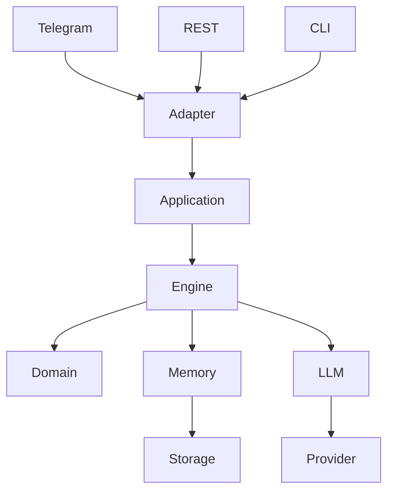
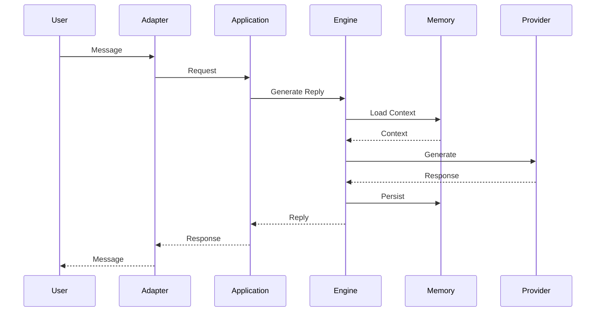

# Architecture

## Purpose

This document describes the high-level architecture of RP Engine.

It defines the system's structure, component responsibilities, dependency rules, and interaction patterns. It complements the functional specification by explaining **how the system is organized**, without prescribing implementation details.

---

# Architectural Goals

The architecture is designed to achieve the following goals:

* Platform independence
* Provider independence
* Long-term maintainability
* Testability
* Modularity
* Extensibility
* Separation of concerns

---

# Architectural Style

RP Engine follows a layered architecture inspired by Hexagonal Architecture (Ports & Adapters).

The core domain is isolated from external technologies.

External systems communicate with the application through adapters.



The core engine must not depend on Telegram, FastAPI, LM Studio, or any other external framework.

---

# Layers

## Adapters

Adapters translate external requests into application requests.

Examples include:

* Telegram
* REST API
* CLI
* Discord
* Matrix

Responsibilities:

* Receive external requests
* Validate transport-specific data
* Convert requests into application models
* Return responses to the caller

Adapters contain no business logic.

---

## Application

The application layer coordinates use cases.

Responsibilities:

* Conversation lifecycle
* Dependency orchestration
* Transaction boundaries
* Request validation
* Error handling

The application layer does not implement domain rules.

---

## Engine

The engine contains the orchestration logic for roleplay interactions.

Responsibilities include:

* Prompt construction
* Memory retrieval
* Character loading
* World loading
* Response generation workflow
* Context assembly

The engine coordinates services but avoids platform-specific concerns.

---

## Domain

The domain layer contains the business concepts.

Examples:

* Conversation
* Session
* Character
* World
* Memory
* Message

The domain should contain no framework dependencies.

---

## Infrastructure

Infrastructure provides implementations for external concerns.

Examples:

* File storage
* Databases
* Logging
* Configuration
* LLM providers

Infrastructure depends on the domain, never the reverse.

---

# Dependency Rules

Dependencies flow inward.

```text
Adapters
    ↓
Application
    ↓
Engine
    ↓
Domain

Infrastructure ─────► Domain
Infrastructure ─────► Engine
```

Allowed dependencies:

* Adapters → Application
* Application → Engine
* Engine → Domain
* Infrastructure → Domain

Forbidden dependencies:

* Domain → FastAPI
* Domain → Telegram
* Domain → LM Studio
* Domain → File System
* Engine → Telegram
* Engine → FastAPI

---

# Major Components

## Conversation Manager

Responsible for:

* Session lookup
* Message ordering
* Conversation lifecycle

---

## Memory Manager

Responsible for:

* Recent context
* Long-term memory
* Retrieval
* Summarization

---

## Prompt Builder

Responsible for assembling model input.

Possible inputs include:

* Recent messages
* Character information
* World information
* Memory retrieval
* System prompts

---

## Provider Interface

Defines a common abstraction for language model providers.

Example implementations:

* LM Studio
* Ollama
* llama.cpp
* OpenAI-compatible APIs

The engine communicates only through this abstraction.

---

# Request Flow

A typical conversation follows this sequence.



---

# State Management

The engine maintains several categories of state.

## Conversation State

* Recent messages
* Active participants
* Session metadata

---

## Character State

* Personality
* Knowledge
* Relationships
* Persistent attributes

---

## World State

* Locations
* Objects
* Events
* Global facts

---

## Memory State

* Long-term summaries
* Retrieved memories
* Embeddings (optional)

---

# Configuration

Configuration is external to the application.

Examples include:

* Active provider
* Model name
* Memory limits
* Feature flags
* Storage backend

The application should not require code changes to modify runtime behavior.

---

# Extensibility

The architecture is designed so new capabilities can be added by extension rather than modification.

Examples include:

* New adapters
* New LLM providers
* New storage backends
* Alternative memory implementations

Existing business logic should remain unchanged whenever possible.

---

# Design Principles

The architecture follows these principles:

* Separation of concerns
* Dependency inversion
* Composition over inheritance
* Explicit interfaces
* Immutable data where practical
* Async-first design
* Strong typing
* High cohesion
* Low coupling

---

# Architecture Decision Records

Major architectural decisions are documented separately in `DECISIONS.md`.

This document describes the architecture.

`DECISIONS.md` explains why specific architectural choices were made.
