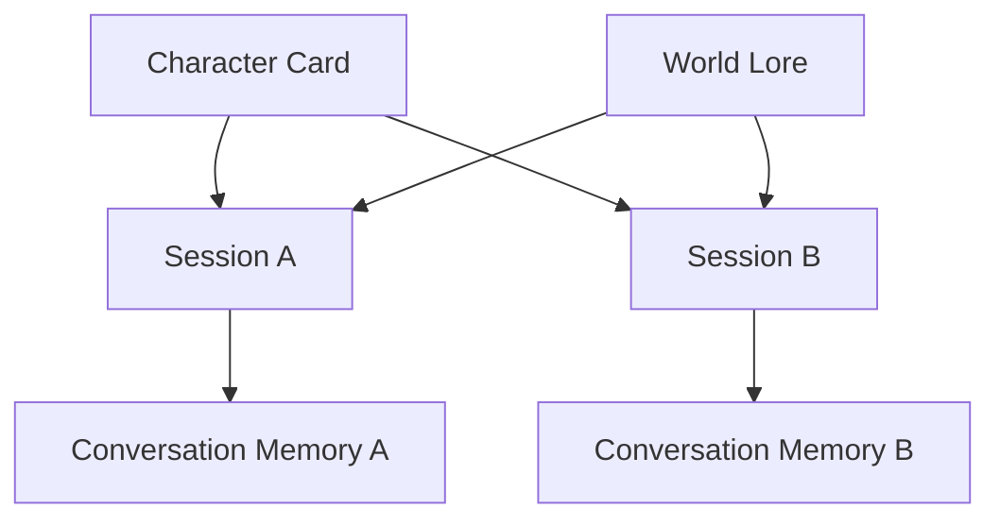
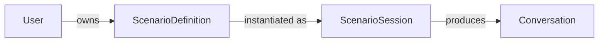

# Domain Model

## User

The engine owns a provider-agnostic `User` entity.

`User` fields:

* `id` (`UUID`) - internal, collision-resistant identifier generated by the engine.
* `display_name` (`str`) - user-facing name that may change.
* `identities` (`tuple[UserIdentity, ...]`) - linked external identities.

The internal `User.id` is the canonical identifier for engine user-scoped concerns such as
conversation ownership and persistence keys.

## Group

The engine owns a provider-agnostic `Group` entity for shared RP contexts.

`Group` fields:

* `id` (`UUID`) - internal, collision-resistant identifier generated by the engine.
* `display_name` (`str`) - group-facing name that may change.
* `identities` (`tuple[GroupIdentity, ...]`) - linked external group identities.

`Group.id` is the canonical group identifier for group-owned sessions.

## GroupIdentity

External group identities are represented separately from user identities.

`GroupIdentity` fields:

* `provider` (`str`) - source platform or system (`telegram`, `discord`, etc.).
* `external_id` (`str`) - provider-native group/chat identifier.
* `metadata` (`dict[str, str]`) - provider-specific attributes.

## UserIdentity

External platforms are represented as linked identities.

`UserIdentity` fields:

* `provider` (`str`) - source platform or system (`telegram`, `discord`, etc.).
* `external_id` (`str`) - provider-native identifier.
* `metadata` (`dict[str, str]`) - provider-specific attributes.

`UserIdentity` data is transport metadata. It is not the engine primary key.

## Boundary Rules

* Core domain and application services do not depend on Telegram-specific types.
* Adapters resolve external identities into `User` before invoking use cases.
* External identifiers are never used as primary user IDs inside the engine.

## Character

Roleplay personas are represented as `Character` entities. A character is a **pure
persona** — identity and behavior only. It is embedded in a `ScenarioDefinition` (keyed by
role) and has no independent ownership or visibility of its own: those are properties of
the scenario that contains it (see `ScenarioDefinition` and `ScenarioVisibility`).

`Character` fields:

* `id` (`str`) - stable application-owned identifier (slug or UUID).
* `name` (`str`) - display name.
* `description` (`str`) - high-level identity description.
* `personality` (`str`) - behavior profile.
* `greeting` (`str`) - optional opening text.
* `metadata` (`dict[str, str]`) - optional structured tags.

Character static definition is stored separately from session memory.

## Character Definition vs Character Memory

`Character` represents a reusable definition template (character card).

The canonical portable character definition format is Character Card Specification v3
(`docs/SPEC_V3.md`).

RP Engine maps Character Card v3 fields into its internal `Character` domain model while keeping
engine-specific ownership and runtime concerns outside the card itself.

Character Definition examples:

* `name`
* `personality`
* `description`
* `appearance`
* `scenario`
* `rules`
* `system prompt`
* `initial world context`

Core Character Card v3 mapping (non-exhaustive):

* `name` -> `Character.name`
* `description` -> `Character.description`
* `personality` -> `Character.personality`
* `first_mes` -> `Character.greeting`

Engine-specific fields are not part of the Character Card v3 object:

* session identity and conversation history
* memory persistence and retrieval metadata
* scenario-level ownership and visibility (see `ScenarioDefinition`)

Runtime continuity is currently represented by conversation memory, not by a dedicated
structured `CharacterState` entity.

Current distinctions:

* Character Definition changes rarely and is reusable across sessions.
* Session memory evolves continuously through conversation history and memory strategy.
* Multiple sessions can use the same Character definition with independent history.
* Character consistency is enforced through card + memory + lore context assembly.



Structured runtime state (for example inventory, health, quest flags, simulation variables)
is explicitly deferred until a concrete feature requires deterministic mechanics.

## ScenarioVisibility

Access control lives on the scenario, not the character. Visibility is represented by
`ScenarioVisibility`.

`ScenarioVisibility` values:

* `PUBLIC` - listed in `/scenarios` and playable by anyone (default).
* `UNLISTED` - hidden from `/scenarios`, but playable by anyone who knows the id.
* `RESTRICTED` - listed and playable only for the Telegram group chat ids in the
  scenario's `allowed_group_chat_ids`; hidden from everyone else.

Access is evaluated per caller. Group callers are identified by their Telegram chat id;
direct (1:1) chats are outsiders for a `RESTRICTED` scenario.

## World

Roleplay environments are represented as reusable `World` entities.

`World` fields:

* `id` (`str`) - stable application-owned identifier.
* `name` (`str`) - display name.
* `description` (`str`) - environment summary.
* `rules` (`tuple[str, ...]`) - optional world constraints.
* `metadata` (`dict[str, str]`) - optional world tags.

## Scenario Overview

The engine is scenario-centric. A scenario is the primary organizing concept for
roleplay; `Character` is an optional, reusable asset used *within* a scenario rather
than the root entity.

Two entities express this split:

* `ScenarioDefinition` - a reusable, immutable blueprint (the template).
* `ScenarioSession` - a runtime instance of a scenario being played.



Cardinality:

* `User` (1) ---> (*) `ScenarioDefinition`
* `ScenarioDefinition` (1) ---> (*) `ScenarioSession`

One scenario definition can back many independent sessions, each with its own runtime
state and conversation history.

## ScenarioDefinition

`ScenarioDefinition` is the reusable blueprint. It is definition data only and carries
no runtime state.

`ScenarioDefinition` fields:

* `id` (`str`) - stable application-owned identifier.
* `owner_id` (`UUID`) - canonical owner user identifier.
* `name` (`str`) - display name.
* `description` (`str`) - high-level summary.
* `world` (`World | None`) - optional environment.
* `characters` (`dict[str, Character]`) - concrete characters keyed by role name.
* `rules` (`list[str]`) - the scenario's roleplay rules.
* `story_graph` (`StoryGraph | None`) - optional narrative structure.
* `initial_context` (`str`) - opening narrative context.
* `visibility` (`ScenarioVisibility`) - `PUBLIC`, `UNLISTED`, or `RESTRICTED`.
* `allowed_group_chat_ids` (`tuple[str, ...]`) - Telegram chat ids allowed to see/play a
  `RESTRICTED` scenario.
* `metadata` (`dict[str, str]`) - optional structured tags.

Characters are optional. A scenario may define only a world and rules (freeform), or
bind concrete characters to declared roles (cast), or anything in between. Roles are cast
to concrete characters directly via a session's `active_participants`; there is no
abstract role type.

## StoryGraph

`StoryGraph` is an optional, inert narrative structure. It is pure data with no
traversal behaviour; how transitions are evaluated is a deliberately deferred runtime
concern.

`StoryGraph` fields:

* `beats` (`dict[str, StoryBeat]`) - narrative checkpoints keyed by beat id.
* `entry_beat_id` (`str | None`) - starting beat.
* `metadata` (`dict[str, str]`) - optional tags.

`StoryBeat` fields:

* `id` (`str`) - beat identifier.
* `description` (`str`) - what happens at this beat.
* `transitions` (`dict[str, str]`) - named condition -> next beat id.
* `metadata` (`dict[str, str]`) - optional tags.

A scenario with no narrative structure simply omits the story graph.

## ScenarioSession

`ScenarioSession` is a runtime instance of a scenario. It references a definition and
holds all evolving state.

`ScenarioSession` fields:

* `id` (`UUID`) - canonical session key.
* `scenario_definition_id` (`str`) - the blueprint this session runs.
* `owner_kind` (`"user" | "group"`) - owner category.
* `owner_id` (`UUID`) - internal engine owner identifier.
* `active_participants` (`dict[str, str]`) - role name -> character id currently cast.
* `world_state` (`dict[str, Any]`) - runtime world variables.
* `story_progress` (`dict[str, Any]`) - runtime narrative progress (e.g. current beat).
* `created_at` (`datetime`) - creation timestamp.
* `updated_at` (`datetime`) - last write of any kind; stamped by the store on every `save`.
* `deleted_at` (`datetime | None`) - **null = the live session**; set when a reset supersedes it.
* `metadata` (`dict[str, str]`) - optional session metadata.
* `directives` (`SessionDirectives`) - the player's directives for this session.
* `user_persona_name` (`str | None`) - the player's own character; what `{{user}}` resolves to.
* `user_persona_description` (`str | None`) - free text rendered as the `[User Persona]` section.

Session-scoped conversation persistence and memory keys are derived from
`ScenarioSession.id`.

Definition vs runtime separation:

* Immutable blueprint data lives on `ScenarioDefinition`.
* Evolving state (participants, world state, story progress) lives on `ScenarioSession`.
* Multiple sessions can run the same definition with independent state.

### Lifecycle

`deleted_at IS NULL` **is** the definition of "the current session" for an owner and
scenario. `/restart` and `/clear` do not delete or orphan the outgoing session — they stamp
it (`ScenarioSession.mark_deleted()`) and create its replacement. A superseded session keeps
its row *and its whole transcript*, and stays readable by id, so a playthrough's full history
remains available for debugging; it simply stops being found by `find_by_definition`,
`get_active_for_owner`, and the default `find_by_owner`. Hard delete (the admin panel's
"Delete session") is a separate, real purge.

### User persona

The player's own character, captured on a genuinely new session before the story intro is
shown: the first line of their reply is the name, the rest is the description (`/skip` falls
back to the transport display name with no description). It is **immutable once set** —
`ScenarioSession.with_persona()` refuses a second one — because the name is substituted into
every prompt and into the transcript already written, so changing it mid-story would rewrite
history. `/clear` is the supported way to change it, by starting a new session.

`{{user}}` resolves to `user_persona_name` when set and falls back to the transport display
name otherwise (`ScenarioSession.resolve_user_name`). Group sessions are out of scope for
now: they have no single player to ask, and their `{{user}}` stays the group's own name.

Set-once is a **player-facing** contract. An operator may set *or replace* a persona from
the admin panel (`PUT /admin/sessions/{id}/persona`) — for sessions that predate the feature,
or to correct a typo'd name — through a separate domain transition, `override_persona`, so
`with_persona`'s guard keeps protecting every path a player can reach. Superseded sessions
are refused (409): their prompt is never built again, so an edit would be a silent no-op.
See ADR-025's amendment for why renaming is confirmed in the UI.

## SessionDirectives

`SessionDirectives` groups the three player-set controls that steer one session. They are
grouped because they share a destination — a dedicated system-prompt section — and differ
only in lifetime:

| Field | Set by | Lifetime |
|---|---|---|
| `language` (`str`) | `/language <code>` | persistent, until changed (`auto` = no instruction) |
| `rules` (`tuple[ScenarioRule, ...]`) | `/rule add`, `/rule remove` | persistent, until removed |
| `director_instruction` (`str`) | `/director <instruction>` | one turn — cleared by the generation that consumes it |

`ScenarioRule` is `(id, text)`. Rule ids are monotonic within a session and never reused,
so an id a player read from `/rules` keeps pointing at the same rule after other rules are
removed.

Placement in the prompt (`ConversationBuilder`): permanent identity and behavior first,
then persistent preferences, then the highest-priority-but-transient director note, then
dynamic context:

```
Scenario → Character → World → User Persona → Rules → Response Format
  → Language → Scenario Rules → Director Instructions
  → Memory hint → Recent Conversation
```

`User Persona` sits with the static context rather than the directive block: it is world
state for the whole playthrough, not a preference the player revises turn by turn. It is
rendered only when a description exists — the name alone already reaches the model through
every `{{user}}`.

Empty sections are omitted entirely — never rendered as a bare header. Director
instructions are out-of-character: the model is told to follow them silently and never
acknowledge them. `ChatService` clears the instruction after a *successful* generation, so
a failed turn keeps it alive for the retry.

Reset semantics follow **ADR-025**: `/restart` carries `language`, `rules` and the user
persona into the fresh session (dropping only the pending director instruction, which was
aimed at a reply that will never happen), while `/clear` resets them to defaults and asks for
a new persona. The rule for any future per-session field: player-owned settings survive
`/restart` and are reset by `/clear`; story-produced state is reset by both. Both tiers share
one code path (`PlaythroughService._reset`), differing only in a `carry_player_state` flag.

## Session (removed)

> **Historical note.** The character-centric `Session` entity (which bound
> `owner + character + world`) was removed once the runtime became fully scenario-native.
> `ScenarioSession` is the sole roleplay ownership boundary. The legacy `Session` domain
> type, its `SessionStore` port, the JSON/PostgreSQL session stores, and the `sessions` /
> `active_sessions` tables were deleted (Alembic migration `20260722_0004`). See ADR-023.
> Pre-migration session data is not carried forward.

## ConversationRole

The conversation domain uses roleplay-first roles:

* `system`
* `user`
* `character`

The domain model does not use provider-specific roles such as `assistant`.

## ConversationMessage

Structured conversation history entries are represented by `ConversationMessage`.

`ConversationMessage` fields:

* `role` (`ConversationRole`) - the domain speaker role.
* `content` (`str`) - message text.
* `metadata` (`dict[str, str]`) - optional extensible attributes.

Examples of metadata keys include origin identifiers, visibility controls, or future
tool-related annotations.

## Conversation

The provider input boundary is `Conversation`.

`Conversation` fields:

* `messages` (`list[ConversationMessage]`) - ordered sequence passed to the provider adapter.
* `metadata` (`dict[str, str]`) - optional conversation-level attributes.

`Conversation` lifecycle scope:

* A conversation belongs to one session.
* Cross-session history sharing does not occur by default.

## ConversationBuilder

`ConversationBuilder` assembles provider-independent conversations from domain context.

Input context includes:

* `Session`
* `User`
* `Character`
* `World`
* structured memory history
* current user instruction

Responsibilities:

* enforce message ordering
* resolve `{{char}}` and `{{user}}` templates
* produce final structured conversation payload without unresolved templates

## GenerationSettings

Generation parameters are represented separately from conversation data.

`GenerationSettings` fields:

* `temperature` (`float`) - sampling temperature.
* `max_tokens` (`int`) - generation token limit.
* `top_p` (`float | None`) - optional nucleus sampling value.
* `stop_sequences` (`tuple[str, ...]`) - optional provider-agnostic stop markers.

These settings are translated by provider adapters into provider-native SDK configuration objects.

## LLMResponse

Provider output is represented by a provider-independent `LLMResponse` model.

`LLMResponse` fields:

* `content` (`str`) - generated text.
* `finish_reason` (`"stop" | "length" | "unknown"`) - normalized completion reason.
* `metadata` (`dict[str, str]`) - optional provider metadata.

Application services receive `LLMResponse`, never SDK-specific response objects.
