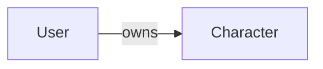
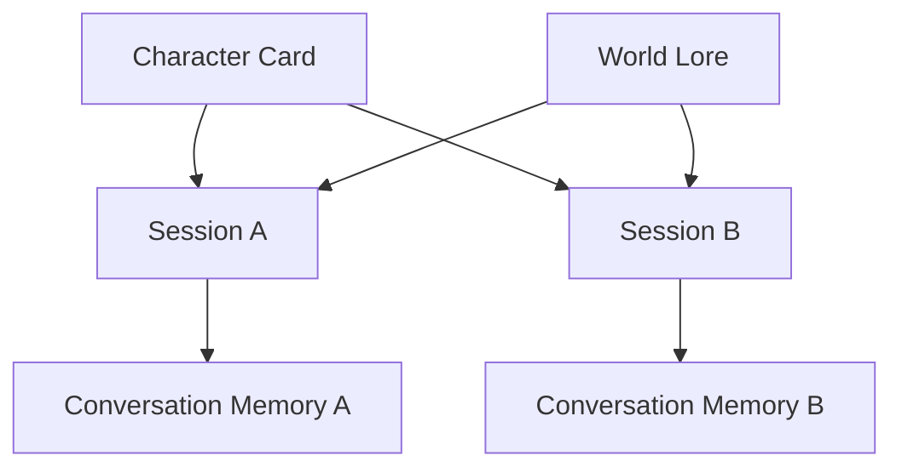
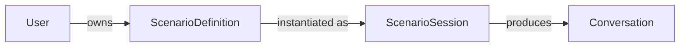

# Domain Model

## User

The engine owns a provider-agnostic `User` entity.

`User` fields:

* `id` (`UUID`) - internal, collision-resistant identifier generated by the engine.
* `display_name` (`str`) - user-facing name that may change.
* `identities` (`tuple[UserIdentity, ...]`) - linked external identities.

The internal `User.id` is the canonical identifier for engine user-scoped concerns such as
conversation ownership and persistence keys.

## Group

The engine owns a provider-agnostic `Group` entity for shared RP contexts.

`Group` fields:

* `id` (`UUID`) - internal, collision-resistant identifier generated by the engine.
* `display_name` (`str`) - group-facing name that may change.
* `identities` (`tuple[GroupIdentity, ...]`) - linked external group identities.

`Group.id` is the canonical group identifier for group-owned sessions.

## GroupIdentity

External group identities are represented separately from user identities.

`GroupIdentity` fields:

* `provider` (`str`) - source platform or system (`telegram`, `discord`, etc.).
* `external_id` (`str`) - provider-native group/chat identifier.
* `metadata` (`dict[str, str]`) - provider-specific attributes.

## UserIdentity

External platforms are represented as linked identities.

`UserIdentity` fields:

* `provider` (`str`) - source platform or system (`telegram`, `discord`, etc.).
* `external_id` (`str`) - provider-native identifier.
* `metadata` (`dict[str, str]`) - provider-specific attributes.

`UserIdentity` data is transport metadata. It is not the engine primary key.

## Boundary Rules

* Core domain and application services do not depend on Telegram-specific types.
* Adapters resolve external identities into `User` before invoking use cases.
* External identifiers are never used as primary user IDs inside the engine.

## Character

Roleplay personas are represented as reusable `Character` entities.

`Character` fields:

* `id` (`str`) - stable application-owned identifier (slug or UUID).
* `owner_id` (`UUID`) - canonical owner user identifier.
* `visibility` (`CharacterVisibility`) - access level (`PRIVATE`, `SHARED`, `PUBLIC`).
* `name` (`str`) - display name.
* `description` (`str`) - high-level identity description.
* `personality` (`str`) - behavior profile.
* `greeting` (`str`) - optional opening text.
* `metadata` (`dict[str, str]`) - optional structured tags.

Character static definition is stored separately from session memory.

## Character Ownership

Every `Character` has exactly one owner.

Ownership rules:

* `User` owns `Character`.
* One `User` can own many `Character` entities.
* One `Character` has exactly one owner.
* Ownership is permanent unless explicitly transferred (future feature).
* Characters exist independently from conversations.

Cardinality:

* `User` (1) ---> (*) `Character`

## Character Definition vs Character Memory

`Character` represents a reusable definition template (character card).

The canonical portable character definition format is Character Card Specification v3
(`docs/SPEC_V3.md`).

RP Engine maps Character Card v3 fields into its internal `Character` domain model while keeping
engine-specific ownership and runtime concerns outside the card itself.

Character Definition examples:

* `name`
* `personality`
* `description`
* `appearance`
* `scenario`
* `rules`
* `system prompt`
* `initial world context`

Core Character Card v3 mapping (non-exhaustive):

* `name` -> `Character.name`
* `description` -> `Character.description`
* `personality` -> `Character.personality`
* `first_mes` -> `Character.greeting`

Engine-specific fields are not part of the Character Card v3 object:

* `owner_id`
* `visibility`
* session identity and conversation history
* memory persistence and retrieval metadata

Runtime continuity is currently represented by conversation memory, not by a dedicated
structured `CharacterState` entity.

Current distinctions:

* Character Definition changes rarely and is reusable across sessions.
* Session memory evolves continuously through conversation history and memory strategy.
* Multiple sessions can use the same Character definition with independent history.
* Character consistency is enforced through card + memory + lore context assembly.

Structured runtime state (for example inventory, health, quest flags, simulation variables)
is explicitly deferred until a concrete feature requires deterministic mechanics.

## CharacterVisibility

Character visibility is represented by `CharacterVisibility`.

`CharacterVisibility` values:

* `PRIVATE`
* `SHARED`
* `PUBLIC`

Visibility semantics:

* `PRIVATE` - only the owner can use the character (current implementation).
* `SHARED` - future feature; available only to explicitly authorized users or groups.
* `PUBLIC` - future feature; discoverable and usable by everyone.

Visibility affects access only.

Ownership remains unchanged regardless of visibility.

## World

Roleplay environments are represented as reusable `World` entities.

`World` fields:

* `id` (`str`) - stable application-owned identifier.
* `name` (`str`) - display name.
* `description` (`str`) - environment summary.
* `rules` (`tuple[str, ...]`) - optional world constraints.
* `metadata` (`dict[str, str]`) - optional world tags.

## Scenario Overview

The engine is scenario-centric. A scenario is the primary organizing concept for
roleplay; `Character` is an optional, reusable asset used *within* a scenario rather
than the root entity.

Two entities express this split:

* `ScenarioDefinition` - a reusable, immutable blueprint (the template).
* `ScenarioSession` - a runtime instance of a scenario being played.

Cardinality:

* `User` (1) ---> (*) `ScenarioDefinition`
* `ScenarioDefinition` (1) ---> (*) `ScenarioSession`

One scenario definition can back many independent sessions, each with its own runtime
state and conversation history.

## ScenarioDefinition

`ScenarioDefinition` is the reusable blueprint. It is definition data only and carries
no runtime state.

`ScenarioDefinition` fields:

* `id` (`str`) - stable application-owned identifier.
* `owner_id` (`UUID`) - canonical owner user identifier.
* `name` (`str`) - display name.
* `description` (`str`) - high-level summary.
* `world` (`World | None`) - optional environment.
* `role_profiles` (`dict[str, RoleProfile]`) - abstract roles keyed by role name.
* `characters` (`dict[str, Character]`) - concrete characters keyed by role name.
* `rules` (`list[str]`) - scenario-specific constraints.
* `story_graph` (`StoryGraph | None`) - optional narrative structure.
* `initial_context` (`str`) - opening narrative context.
* `metadata` (`dict[str, str]`) - optional structured tags.

Characters are optional. A scenario may define only a world and rules (freeform), or
bind concrete characters to declared roles (cast), or anything in between.

## RoleProfile

`RoleProfile` describes an abstract role in a scenario, independent of any concrete
character. At runtime a `ScenarioSession` maps a character onto each role.

`RoleProfile` fields:

* `id` (`str`) - stable role identifier.
* `name` (`str`) - display name.
* `description` (`str`) - what the role is.
* `objectives` (`tuple[str, ...]`) - optional in-scenario goals.
* `constraints` (`tuple[str, ...]`) - optional behavioural constraints.
* `metadata` (`dict[str, str]`) - optional structured tags.

## StoryGraph

`StoryGraph` is an optional, inert narrative structure. It is pure data with no
traversal behaviour; how transitions are evaluated is a deliberately deferred runtime
concern.

`StoryGraph` fields:

* `beats` (`dict[str, StoryBeat]`) - narrative checkpoints keyed by beat id.
* `entry_beat_id` (`str | None`) - starting beat.
* `metadata` (`dict[str, str]`) - optional tags.

`StoryBeat` fields:

* `id` (`str`) - beat identifier.
* `description` (`str`) - what happens at this beat.
* `transitions` (`dict[str, str]`) - named condition -> next beat id.
* `metadata` (`dict[str, str]`) - optional tags.

A scenario with no narrative structure simply omits the story graph.

## ScenarioSession

`ScenarioSession` is a runtime instance of a scenario. It references a definition and
holds all evolving state.

`ScenarioSession` fields:

* `id` (`UUID`) - canonical session key.
* `scenario_definition_id` (`str`) - the blueprint this session runs.
* `owner_kind` (`"user" | "group"`) - owner category.
* `owner_id` (`UUID`) - internal engine owner identifier.
* `active_participants` (`dict[str, str]`) - role name -> character id currently cast.
* `world_state` (`dict[str, Any]`) - runtime world variables.
* `story_progress` (`dict[str, Any]`) - runtime narrative progress (e.g. current beat).
* `created_at` (`datetime`) - creation timestamp.
* `metadata` (`dict[str, str]`) - optional session metadata.

Session-scoped conversation persistence and memory keys are derived from
`ScenarioSession.id`.

Definition vs runtime separation:

* Immutable blueprint data lives on `ScenarioDefinition`.
* Evolving state (participants, world state, story progress) lives on `ScenarioSession`.
* Multiple sessions can run the same definition with independent state.

## Session (legacy)

> **Migration note.** `Session` is the previous character-centric runtime entity and is
> being replaced by `ScenarioSession`. It remains documented while application services
> and adapters are migrated. Backward compatibility with pre-migration sessions is **not**
> guaranteed during the beta; existing sessions may need to be recreated.

Roleplay context is owned by `Session`, not directly by adapter identities.

`Session` fields:

* `id` (`UUID`) - canonical session key.
* `owner_kind` (`"user" | "group"`) - owner category.
* `owner_id` (`UUID`) - internal engine owner identifier.
* `character_id` (`str`) - selected character.
* `world_id` (`str`) - selected world.
* `created_at` (`datetime`) - creation timestamp.
* `metadata` (`dict[str, str]`) - optional session metadata.

Session-scoped conversation persistence and memory keys are derived from `Session.id`.

Session ownership examples:

* private flow: `owner_kind="user"`, `owner_id=<User.id>`
* group flow: `owner_kind="group"`, `owner_id=<Group.id>`

## ConversationRole

The conversation domain uses roleplay-first roles:

* `system`
* `user`
* `character`

The domain model does not use provider-specific roles such as `assistant`.

## ConversationMessage

Structured conversation history entries are represented by `ConversationMessage`.

`ConversationMessage` fields:

* `role` (`ConversationRole`) - the domain speaker role.
* `content` (`str`) - message text.
* `metadata` (`dict[str, str]`) - optional extensible attributes.

Examples of metadata keys include origin identifiers, visibility controls, or future
tool-related annotations.

## Conversation

The provider input boundary is `Conversation`.

`Conversation` fields:

* `messages` (`list[ConversationMessage]`) - ordered sequence passed to the provider adapter.
* `metadata` (`dict[str, str]`) - optional conversation-level attributes.

`Conversation` lifecycle scope:

* A conversation belongs to one session.
* Cross-session history sharing does not occur by default.

## ConversationBuilder

`ConversationBuilder` assembles provider-independent conversations from domain context.

Input context includes:

* `Session`
* `User`
* `Character`
* `World`
* structured memory history
* current user instruction

Responsibilities:

* enforce message ordering
* resolve `{{char}}` and `{{user}}` templates
* produce final structured conversation payload without unresolved templates

## GenerationSettings

Generation parameters are represented separately from conversation data.

`GenerationSettings` fields:

* `temperature` (`float`) - sampling temperature.
* `max_tokens` (`int`) - generation token limit.
* `top_p` (`float | None`) - optional nucleus sampling value.
* `stop_sequences` (`tuple[str, ...]`) - optional provider-agnostic stop markers.

These settings are translated by provider adapters into provider-native SDK configuration objects.

## LLMResponse

Provider output is represented by a provider-independent `LLMResponse` model.

`LLMResponse` fields:

* `content` (`str`) - generated text.
* `finish_reason` (`"stop" | "length" | "unknown"`) - normalized completion reason.
* `metadata` (`dict[str, str]`) - optional provider metadata.

Application services receive `LLMResponse`, never SDK-specific response objects.
