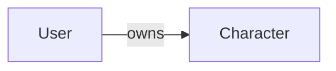
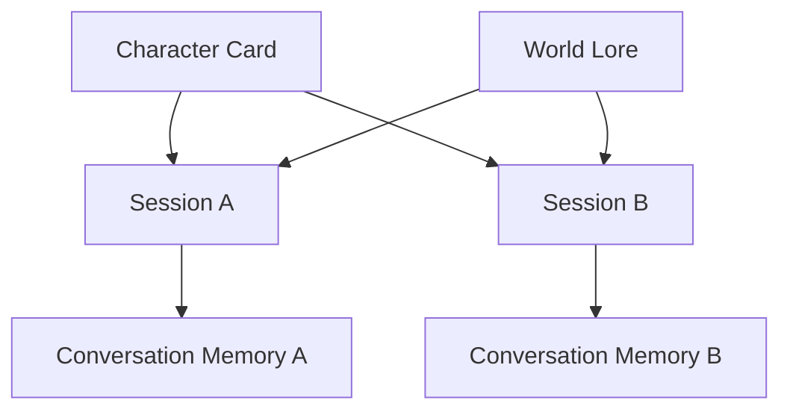

# Domain Model

## User

The engine owns a provider-agnostic `User` entity.

`User` fields:

* `id` (`UUID`) - internal, collision-resistant identifier generated by the engine.
* `display_name` (`str`) - user-facing name that may change.
* `identities` (`tuple[UserIdentity, ...]`) - linked external identities.

The internal `User.id` is the canonical identifier for engine user-scoped concerns such as
conversation ownership and persistence keys.

## Group

The engine owns a provider-agnostic `Group` entity for shared RP contexts.

`Group` fields:

* `id` (`UUID`) - internal, collision-resistant identifier generated by the engine.
* `display_name` (`str`) - group-facing name that may change.
* `identities` (`tuple[GroupIdentity, ...]`) - linked external group identities.

`Group.id` is the canonical group identifier for group-owned sessions.

## GroupIdentity

External group identities are represented separately from user identities.

`GroupIdentity` fields:

* `provider` (`str`) - source platform or system (`telegram`, `discord`, etc.).
* `external_id` (`str`) - provider-native group/chat identifier.
* `metadata` (`dict[str, str]`) - provider-specific attributes.

## UserIdentity

External platforms are represented as linked identities.

`UserIdentity` fields:

* `provider` (`str`) - source platform or system (`telegram`, `discord`, etc.).
* `external_id` (`str`) - provider-native identifier.
* `metadata` (`dict[str, str]`) - provider-specific attributes.

`UserIdentity` data is transport metadata. It is not the engine primary key.

## Boundary Rules

* Core domain and application services do not depend on Telegram-specific types.
* Adapters resolve external identities into `User` before invoking use cases.
* External identifiers are never used as primary user IDs inside the engine.

## Character

Roleplay personas are represented as reusable `Character` entities.

`Character` fields:

* `id` (`str`) - stable application-owned identifier (slug or UUID).
* `owner_id` (`UUID`) - canonical owner user identifier.
* `visibility` (`CharacterVisibility`) - access level (`PRIVATE`, `SHARED`, `PUBLIC`).
* `name` (`str`) - display name.
* `description` (`str`) - high-level identity description.
* `personality` (`str`) - behavior profile.
* `greeting` (`str`) - optional opening text.
* `metadata` (`dict[str, str]`) - optional structured tags.

Character static definition is stored separately from session memory.

## Character Ownership

Every `Character` has exactly one owner.

Ownership rules:

* `User` owns `Character`.
* One `User` can own many `Character` entities.
* One `Character` has exactly one owner.
* Ownership is permanent unless explicitly transferred (future feature).
* Characters exist independently from conversations.

Cardinality:

* `User` (1) ---> (*) `Character`

## Character Definition vs Character Memory

`Character` represents a reusable definition template (character card).

The canonical portable character definition format is Character Card Specification v3
(`docs/SPEC_V3.md`).

RP Engine maps Character Card v3 fields into its internal `Character` domain model while keeping
engine-specific ownership and runtime concerns outside the card itself.

Character Definition examples:

* `name`
* `personality`
* `description`
* `appearance`
* `scenario`
* `rules`
* `system prompt`
* `initial world context`

Core Character Card v3 mapping (non-exhaustive):

* `name` -> `Character.name`
* `description` -> `Character.description`
* `personality` -> `Character.personality`
* `first_mes` -> `Character.greeting`

Engine-specific fields are not part of the Character Card v3 object:

* `owner_id`
* `visibility`
* session identity and conversation history
* memory persistence and retrieval metadata

Runtime continuity is currently represented by conversation memory, not by a dedicated
structured `CharacterState` entity.

Current distinctions:

* Character Definition changes rarely and is reusable across sessions.
* Session memory evolves continuously through conversation history and memory strategy.
* Multiple sessions can use the same Character definition with independent history.
* Character consistency is enforced through card + memory + lore context assembly.

Structured runtime state (for example inventory, health, quest flags, simulation variables)
is explicitly deferred until a concrete feature requires deterministic mechanics.

## CharacterVisibility

Character visibility is represented by `CharacterVisibility`.

`CharacterVisibility` values:

* `PRIVATE`
* `SHARED`
* `PUBLIC`

Visibility semantics:

* `PRIVATE` - only the owner can use the character (current implementation).
* `SHARED` - future feature; available only to explicitly authorized users or groups.
* `PUBLIC` - future feature; discoverable and usable by everyone.

Visibility affects access only.

Ownership remains unchanged regardless of visibility.

## World

Roleplay environments are represented as reusable `World` entities.

`World` fields:

* `id` (`str`) - stable application-owned identifier.
* `name` (`str`) - display name.
* `description` (`str`) - environment summary.
* `rules` (`tuple[str, ...]`) - optional world constraints.
* `metadata` (`dict[str, str]`) - optional world tags.

## Session

Roleplay context is owned by `Session`, not directly by adapter identities.

`Session` fields:

* `id` (`UUID`) - canonical session key.
* `owner_kind` (`"user" | "group"`) - owner category.
* `owner_id` (`UUID`) - internal engine owner identifier.
* `character_id` (`str`) - selected character.
* `world_id` (`str`) - selected world.
* `created_at` (`datetime`) - creation timestamp.
* `metadata` (`dict[str, str]`) - optional session metadata.

Session-scoped conversation persistence and memory keys are derived from `Session.id`.

Session ownership examples:

* private flow: `owner_kind="user"`, `owner_id=<User.id>`
* group flow: `owner_kind="group"`, `owner_id=<Group.id>`

## ConversationRole

The conversation domain uses roleplay-first roles:

* `system`
* `user`
* `character`

The domain model does not use provider-specific roles such as `assistant`.

## ConversationMessage

Structured conversation history entries are represented by `ConversationMessage`.

`ConversationMessage` fields:

* `role` (`ConversationRole`) - the domain speaker role.
* `content` (`str`) - message text.
* `metadata` (`dict[str, str]`) - optional extensible attributes.

Examples of metadata keys include origin identifiers, visibility controls, or future
tool-related annotations.

## Conversation

The provider input boundary is `Conversation`.

`Conversation` fields:

* `messages` (`list[ConversationMessage]`) - ordered sequence passed to the provider adapter.
* `metadata` (`dict[str, str]`) - optional conversation-level attributes.

`Conversation` lifecycle scope:

* A conversation belongs to one session.
* Cross-session history sharing does not occur by default.

## ConversationBuilder

`ConversationBuilder` assembles provider-independent conversations from domain context.

Input context includes:

* `Session`
* `User`
* `Character`
* `World`
* structured memory history
* current user instruction

Responsibilities:

* enforce message ordering
* resolve `{{char}}` and `{{user}}` templates
* produce final structured conversation payload without unresolved templates

## GenerationSettings

Generation parameters are represented separately from conversation data.

`GenerationSettings` fields:

* `temperature` (`float`) - sampling temperature.
* `max_tokens` (`int`) - generation token limit.
* `top_p` (`float | None`) - optional nucleus sampling value.
* `stop_sequences` (`tuple[str, ...]`) - optional provider-agnostic stop markers.

These settings are translated by provider adapters into provider-native SDK configuration objects.

## LLMResponse

Provider output is represented by a provider-independent `LLMResponse` model.

`LLMResponse` fields:

* `content` (`str`) - generated text.
* `finish_reason` (`"stop" | "length" | "unknown"`) - normalized completion reason.
* `metadata` (`dict[str, str]`) - optional provider metadata.

Application services receive `LLMResponse`, never SDK-specific response objects.
